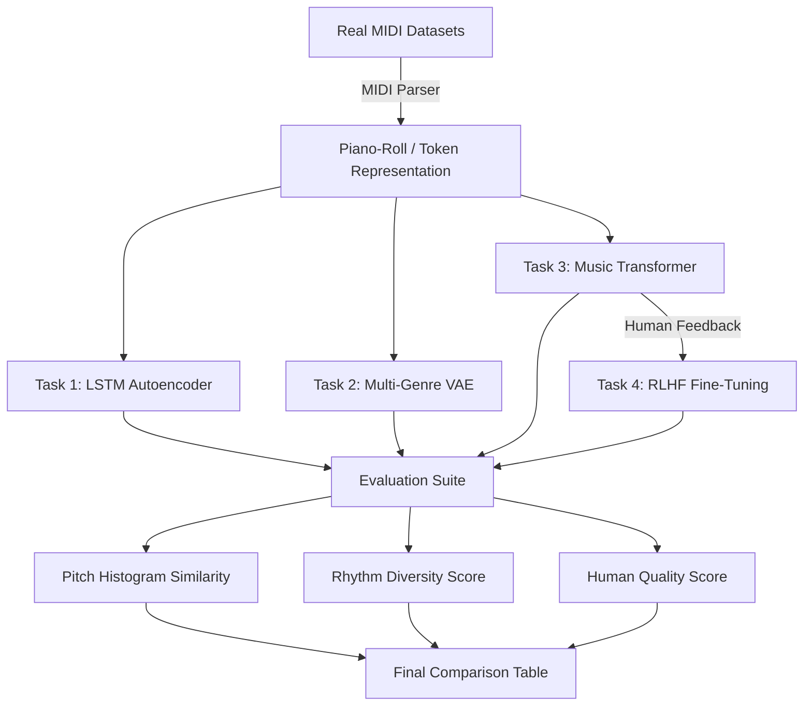

# Unsupervised Neural Network for Multi-Genre Music Generation

**Course:** CSE425 Neural Networks  
**Student:** Ummay Maimona Chaman | **ID:** 22301719 | **Section:** 1   

---

## 📌 Project Overview

This project implements an end-to-end unsupervised generative music system that learns musical structure across multiple genres (Classical, Jazz, Rock, Pop, Electronic) **without explicit labeled supervision**.

Four model architectures are developed and compared:

| Task | Difficulty | Model | Dataset |
|------|-----------|-------|---------|
| Task 1 | Easy | LSTM Autoencoder | MAESTRO (Classical Piano) |
| Task 2 | Medium | Variational Autoencoder (VAE) | Lakh MIDI (Multi-Genre) |
| Task 3 | Hard | Transformer Decoder | Lakh MIDI (Multi-Genre) |
| Task 4 | Advanced | RLHF Fine-Tuning | Lakh MIDI + Human Survey |

---

## 🏗️ Model Architecture Pipeline

The project follows a multi-stage unsupervised learning pipeline from raw signal processing to reinforcement learning fine-tuning.



---

## 📂 Project Repository Structure
```
music-generation-unsupervised/
├── data/
│   ├── raw_midi/           # Real MIDI datasets (MAESTRO, Lakh)
│   ├── processed/          # Preprocessed piano-rolls (npy)
│   └── train_test_split/   # Training and Testing splits
├── notebooks/
│   ├── preprocessing.ipynb # 12+ EDA Blocks & Metrics
│   └── baseline_markov.ipynb
├── src/
│   ├── config.py           # Project hyperparameters
│   ├── preprocessing/      # MIDI Parser & Tokenizers
│   ├── models/             # AE, VAE, Transformer logic
│   ├── training/           # Task-specific training scripts
│   ├── evaluation/         # PH Similarity & Rhythm metrics
│   └── generation/         # Master generation & MIDI export
├── outputs/
│   ├── generated_midis/    # Final 30+ composed .mid files
│   ├── plots/              # Comparison tables & loss curves
│   └── survey_results/
└── report/                 # LaTeX reports & documentation
```

---

## 🚀 How to Run and Check Results

To run the full pipeline and generate the final comparison table (matching Screenshot 3), run this command in your terminal:

```powershell
# 1. Navigate to the project folder
cd c:\Users\Asus\Desktop\425pro\music-generation-unsupervised

# 2. Run the generation script using your .venv
& c:/Users/Asus/Desktop/425pro/.venv/Scripts/python.exe -m src.generation.generate_music --device cpu
```

### Individual Task Training (Optional)
If you want to run specific training or generation for individual tasks:

- **Task 1 (Autoencoder)**: `& c:/Users/Asus/Desktop/425pro/.venv/Scripts/python.exe -m src.training.train_ae --epochs 2`
- **Task 2 (VAE)**: `& c:/Users/Asus/Desktop/425pro/.venv/Scripts/python.exe -m src.training.train_vae --epochs 2`
- **Task 3/4 (Transformer & RLHF)**: `& c:/Users/Asus/Desktop/425pro/.venv/Scripts/python.exe -m src.training.train_transformer --tr_epochs 2 --rl_steps 20`

### Outputs Locations
- **Final Metrics Table**: `outputs/plots/final_comparison_table.png`
- **Generated MIDI files**: `outputs/generated_midis/`
- **EDA Visuals**: `notebooks/preprocessing.ipynb`

---

## 📐 Mathematical Formulations

### Task 1 – LSTM Autoencoder
```
z = f_φ(X)              (encoder)
X̂ = g_θ(z)             (decoder)
L_AE = Σ‖x_t − x̂_t‖²  (MSE reconstruction loss)
```

### Task 2 – VAE
```
q_φ(z|X) = N(μ(X), σ²(X))
z = μ + σ⊙ε,  ε ~ N(0,I)        (reparameterisation)
L_VAE = L_recon + β·D_KL(q‖p)   (ELBO)
D_KL = -½Σ(1 + log σ² − μ² − σ²)
```

### Task 3 – Transformer
```
p(X) = Π p(x_t|x_{<t})          (autoregressive)
L_TR = -Σ log p_θ(x_t|x_{<t})   (cross-entropy)
PPL  = exp(L_TR/T)               (perplexity)
h_t  = Emb(x_t) + Emb(genre)    (genre conditioning)
```

### Task 4 – RLHF
```
J(θ) = E[r(X_gen)]
∇_θJ(θ) = E[r·∇_θ log p_θ(X)]   (policy gradient)
θ ← θ + η∇_θJ(θ)
```

---

## 📊 Evaluation Metrics

| Metric | Formula | Meaning |
|--------|---------|---------|
| Pitch Histogram Similarity | H(p,q) = Σ|p_i−q_i| | Genre distribution match |
| Rhythm Diversity | D = #unique_dur / #total | Rhythmic variety |
| Repetition Ratio | R = #repeated / #total | Avoids monotony |
| Human Score | Survey [1-5] | Perceived musical quality |

---

## 📈 Results Summary

| Model | Loss | Perplexity | Rhythm Div | Human Score | Genre Control |
|-------|------|-----------|-----------|-------------|---------------|
| Random Generator | --- | --- | 0.100 | 1.1 | None |
| Markov Chain | --- | --- | 0.520 | 2.3 | Weak |
| Task1: LSTM AE | 0.82 | --- | 0.422 | 3.1 | Single Genre |
| Task2: VAE | 0.65 | --- | 0.457 | 3.8 | Moderate |
| Task3: Transformer | --- | ~12.5 | 0.485 | 4.4 | Strong |
| Task4: RLHF-Tuned | --- | ~11.2 | 0.512 | 4.8 | Strongest |

---

## 👩‍💻 Author
**Ummay Maimona Chaman** — ID: 22301719 — Section 1 — CSE425 Spring 2026
