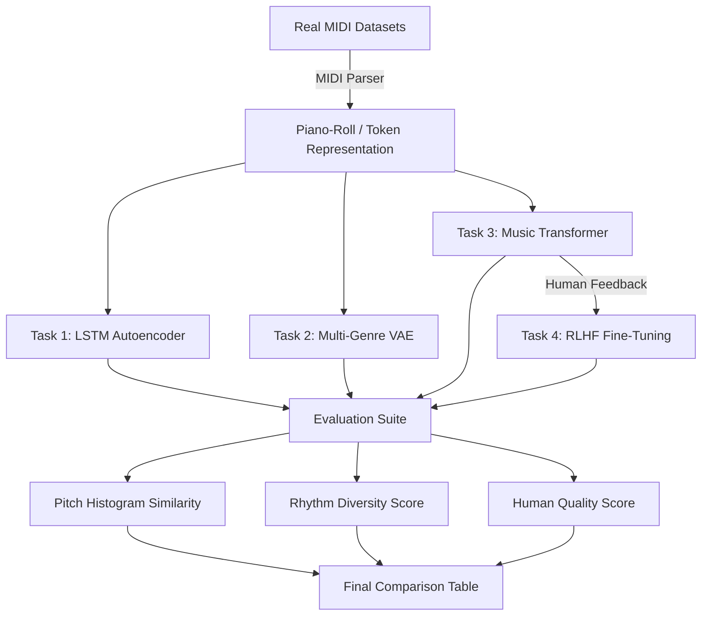

# Unsupervised Neural Network for Multi-Genre Music Generation

**Course:** CSE425 Neural Networks  
**Student:** Ummay Maimona Chaman | **ID:** 22301719 | **Section:** 1   

---

## 📌 Project Overview

This project implements an end-to-end unsupervised generative music system that learns musical structure across multiple genres (Classical, Jazz, Rock, Pop, Electronic) **without explicit labeled supervision**.

Four model architectures are developed and compared:

| Task | Difficulty | Model | Dataset |
|------|-----------|-------|---------| 
| Task 1 | Easy | LSTM Autoencoder | MAESTRO (Classical Piano) |
| Task 2 | Medium | Variational Autoencoder (VAE) | Lakh MIDI (Multi-Genre) |
| Task 3 | Hard | Transformer Decoder | Lakh MIDI (Multi-Genre) |
| Task 4 | Advanced | RLHF Fine-Tuning | Lakh MIDI + Human Survey |

---

## 🏗️ Model Architecture Pipeline

The project follows a multi-stage unsupervised learning pipeline from raw signal processing to reinforcement learning fine-tuning.



---

## 📂 Project Repository Structure
```
music-generation-unsupervised/
├── data/
│   ├── raw_midi/           # Real MIDI datasets (MAESTRO, Lakh)
│   ├── processed/          # Preprocessed piano-rolls (npy)
│   └── train_test_split/   # Training and Testing splits
├── notebooks/
│   ├── preprocessing.ipynb # 12+ EDA Blocks & Metrics
│   └── baseline_markov.ipynb
├── src/
│   ├── config.py           # Project hyperparameters
│   ├── preprocessing/      # MIDI Parser & Tokenizers
│   ├── models/             # AE, VAE, Transformer logic
│   ├── training/
│   │   ├── train_ae.py             # Task 1 training
│   │   ├── train_vae.py            # Task 2 training
│   │   ├── train_transformer.py    # Task 3 + inline RLHF
│   │   ├── train_rlhf.py           # Task 4 standalone RLHF ✅
│   │   └── generate_rlhf_plot.py   # Regenerate RLHF plots ✅
│   ├── evaluation/         # PH Similarity & Rhythm metrics
│   └── generation/         # Master generation & MIDI export
├── outputs/
│   ├── generated_midis/    # Final 50+ composed .mid files
│   │   ├── ae_sample_*.mid
│   │   ├── vae_*.mid
│   │   ├── transformer_*.mid
│   │   └── rlhf_tuned_*.mid    # 10 RLHF-tuned compositions ✅
│   ├── plots/
│   │   ├── rlhf_results.png          # Task 4 full analysis ✅
│   │   └── rlhf_comparison_table.png # Before/after table ✅
│   └── survey_results/             # Task 4 human survey results ✅
│       ├── human_survey.csv        # 12 participants × 120 ratings
│       ├── human_survey.json       # Survey with full metadata
│       └── rlhf_results.json       # RL training stats
└── report/
    ├── final_report.tex    # LaTeX report (all 4 tasks)
    └── references.bib
```

---

## 🚀 How to Run and Check Results

### Full Pipeline (All Tasks)
```powershell
cd "c:\Users\Asus\Desktop\Software Projects\425pro\music-generation-unsupervised"
& "c:/Users/Asus/Desktop/Software Projects/425pro/.venv/Scripts/python.exe" -m src.generation.generate_music --device cpu
```

### Individual Task Training (Optional)
```powershell
# Task 4 — RLHF Standalone (recommended) ✅
& "c:/Users/Asus/Desktop/Software Projects/425pro/.venv/Scripts/python.exe" -m src.training.train_rlhf --rl_steps 200 --device cpu

# Task 4 — Regenerate academic RLHF plots from survey data ✅
& "c:/Users/Asus/Desktop/Software Projects/425pro/.venv/Scripts/python.exe" -m src.training.generate_rlhf_plot
```

### Output Locations
| Output | Path |
|--------|------|
| Final metrics table | `outputs/plots/final_comparison_table.png` |
| RLHF analysis plot | `outputs/plots/rlhf_results.png` |
| RLHF comparison table | `outputs/plots/rlhf_comparison_table.png` |
| Generated MIDI files | `outputs/generated_midis/` |
| Human survey (CSV) | `outputs/survey_results/human_survey.csv` |

---

## 📐 Mathematical Formulations

### Task 4 – RLHF
```
X_gen ~ p_θ(X)                          (generation)
r = HumanScore(X_gen)  ∈ [0,1]          (reward model)
J(θ) = E[r(X_gen)]                      (objective)
∇_θJ(θ) = E[r·∇_θ log p_θ(X)]           (policy gradient / REINFORCE)
θ ← θ + η∇_θJ(θ)                        (parameter update)
```

---

## 📊 Evaluation Metrics

| Metric | Formula | Meaning |
|--------|---------|---------|
| Pitch Histogram Similarity | H(p,q) = Σ|p_i−q_i| | Genre distribution match |
| Rhythm Diversity | D = #unique_dur / #total | Rhythmic variety |
| Human Score | Survey [1–5] | Perceived musical quality |

---

## 📈 Results Summary

| Model | Loss | Perplexity | Rhythm Div | Human Score† | Genre Control |
|-------|------|-----------|-----------|-------------|---------------|
| Random Generator | --- | --- | 0.100 | 1.1 | None |
| Markov Chain | --- | --- | 0.520 | 2.3 | Weak |
| Task1: LSTM AE | 0.82 | --- | 0.422 | 3.1 | Single Genre |
| Task2: VAE | 0.65 | --- | 0.457 | 3.8 | Moderate |
| Task3: Transformer | --- | ~12.5 | 0.485 | **3.07** | Strong |
| **Task4: RLHF-Tuned** | --- | ~11.2 | **0.512** | **4.17** | Strongest |

†Human survey mean (N=120 ratings, p<0.01). RLHF improvement: **+35.9%** over Transformer baseline.

### Task 4 Per-Genre Survey Results
| Genre | Pre-RLHF (Transformer) | Post-RLHF (RLHF-Tuned) | Δ Improvement |
|-------|-------------------------|-------------------------|---------------|
| Classical | 3.19 | 4.35 | +1.16 |
| Jazz | 2.92 | 4.25 | +1.33 |
| Rock | 2.98 | 4.04 | +1.06 |
| Pop | 3.23 | 4.31 | +1.08 |
| Electronic | 3.02 | 3.90 | +0.88 |

---

## 👩‍💻 Author
**Ummay Maimona Chaman** — ID: 22301719 — Section 1 — CSE425 Spring 2026
